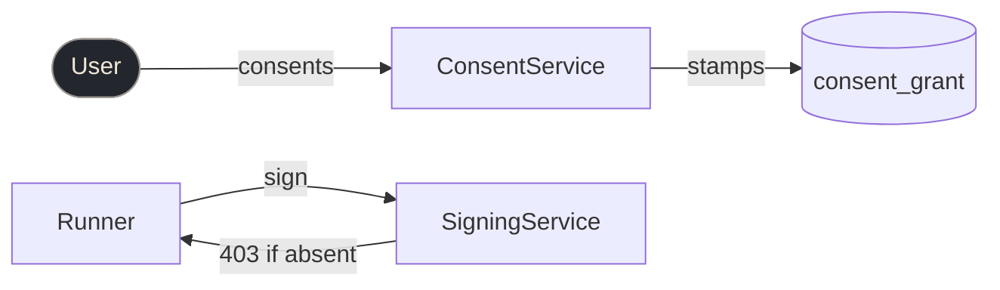

# Tech Design One-Pager

A forcing-function format. The **body fits on ONE page** so humans actually read it; everything deeper — proof, alternatives, detail — lives in the **Evidence appendix**, cited inline. The constraint *is* the value: if it doesn't fit, the thinking isn't tight enough yet.

## Hard rules (enforce these)
- **Body ≤ 1 page.** If it overflows, cut scope or sharpen wording — never shrink to fit.
- **Components are the only vocabulary.** Every noun used in sections 3–6 must be a Component named in §2 (or an external Actor). Define the words once; reuse them. This single rule prevents sprawl.
- **Every non-obvious number/claim in the body carries a `[^E#]` citation, or says `(assumption)`.** No bare assertions. Use **markdown footnote syntax** (`[^E1]`) — the caret keeps the prose readable (it reads as "skip me, I'm a reference") and renders as a real footnote in pandoc/GitHub/Marp, so the doc exports to slides/PDF with proper citations and no custom tooling.
- **Plan is a diff, not a roadmap** — re-list components with status tags, not milestone prose.

## The eight sections (in order)
1. **Intent** — ≤30 characters. The *why*, not the what. One line, hard cap, no sub-line.
2. **Decisions** — 3–5 bullets, one line each: the *consequential, non-obvious, debatable* choices that define this design (NOT defaults). Format `**X over Y** — because Z`, with `[^E#]` if proven. This is what makes it a *design* doc, not a spec — it's what a reviewer would challenge. If a choice is obvious or forced, it doesn't belong here.
3. **Components** — ordered bullet list in the order they appear in the data flow. Each is a ≤2-word **name** plus a ≤10-word description of what it is responsible for: `- **CadencePolicy** — turns outcome stability into a next-due time`. The name is the shared vocabulary for the whole doc; the description is what lets a reader follow §4–§7 without guessing. Keep the description to a single responsibility — if it needs an "and", it is two components.
4. **Data flow** — numbered list. One `Actor verb Object` sentence per step, in execution order (domain storytelling). Each sentence names a Component. Cite `[^E#]` where a step rests on an observation.
5. **Data model** — table `thing | why`. Only what we store that changes or matters.
6. **Interfaces** — per boundary: `input → output` **and the errors the caller must handle** (the failure modes, not internals). Happy-path-only interfaces aren't a contract. Note non-errors that look like errors (e.g. empty result = abstention, not failure).
7. **Plan** — an **ordered** list (build sequence) of the §3 Components, each tagged `[NEW]` / `[CHANGE]` / `[KEEP]` / `[DROP]` + a ≤1-line how. **The order is the approach** — what unblocks what; prerequisites already met sit outside the sequence. Still a diff, not milestone prose — numbering is the only added structure.
8. **Done** — 2–4 **acceptance conditions** that prove the work is complete. Each in the form `measurable end state · proof: command → expected output · invariant`. The forward-looking twin of Evidence: Evidence proves the *premises* (backward), Done proves the *finished work* (forward). **Every condition must be transcript-verifiable** — confirmable from surfaced command output, never "works well." This block IS the [`/goal`](https://code.claude.com/docs/en/goal) condition: its evaluator only reads what the agent surfaces, so a vague Done is unusable. Hand it to `/goal` verbatim and append `or stop after N turns`.

## Diagram (optional, recommended for ≥3 interacting components)
One fenced **```mermaid `flowchart`** block — a C4-flavored component view that makes the interactions graspable in 5 seconds. The rule that keeps it honest and machine-checkable: **every node is a noun already declared in the doc.**
- **Components** (§3) → plain nodes: `SigningService`.
- **Data-model entities** (§5) → datastore nodes: `Grant[(consent_grant)]`.
- **External actors / persons** (not in §3) → mark with `:::ext`: `User([User]):::ext`.
- **Edges = the §4 data-flow verbs**, as edge labels: `User -->|consents| ConsentService`.

Don't invent a node that isn't a Component, an entity, or a marked actor — that's vocabulary sprawl, and the harness rejects it. Renders inline on GitHub/Notion/Marp for free; a tool can rasterize it to a C4-style PNG. (If you use `proposal-deck`: `diagram <file> --skeleton` scaffolds the nodes for you, `--check` typechecks them, `--png` rasterizes.)



## Evidence (appendix — unlimited length)
For each `[^E#]` cited in the body, one **footnote definition** line: `[^E1]: claim · `reproduce command or file:commit` · observed result.` Standard markdown footnote syntax, so the appendix *is* the citation block — renderers collect and link them automatically; no second list to hand-maintain. This is the credibility layer and the dive-deeper path. Prefer a runnable command / query / file path over prose. **Never fabricate a number** — if a claim can't be reproduced yet, mark it `(assumption)` in the body and leave it out of Evidence.

## Excluded from the body (on purpose)
Non-goals, alternatives-considered, and long rationale do **not** belong in the one-pager. If they matter, fold them into the Evidence appendix. Protect the page.

## How to produce one
1. Surface the **Decisions** — the real forks where you chose one path over a credible alternative. If you can't name 3, the design has no spine yet. Then draft **Components**; they constrain everything else.
2. Write **Data flow** as the spine; the other sections hang off it.
3. Fill **Evidence** with REAL reproduce steps — run the spike/query/command and cite the actual result.
4. Derive **Done** from the Interfaces contract + the acceptance the Decisions imply — turn each into a command whose output a reader (or a `/goal` evaluator) can confirm. If you can't write a transcript-verifiable proof for a condition, the design isn't testable yet — sharpen it.
5. Keep the body honest about maturity: tag anything unproven `(assumption)`.
5b. If ≥3 components interact, add the **Diagram** — nodes are exactly your declared vocabulary, edges are your §4 verbs. It doubles as a consistency check: if a node has no home in §3/§5, a section is missing.
6. Read it back as a human: can someone grasp the design in 90 seconds and find the proof for any claim they doubt? If not, cut.
